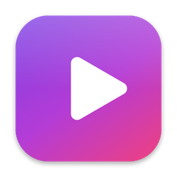
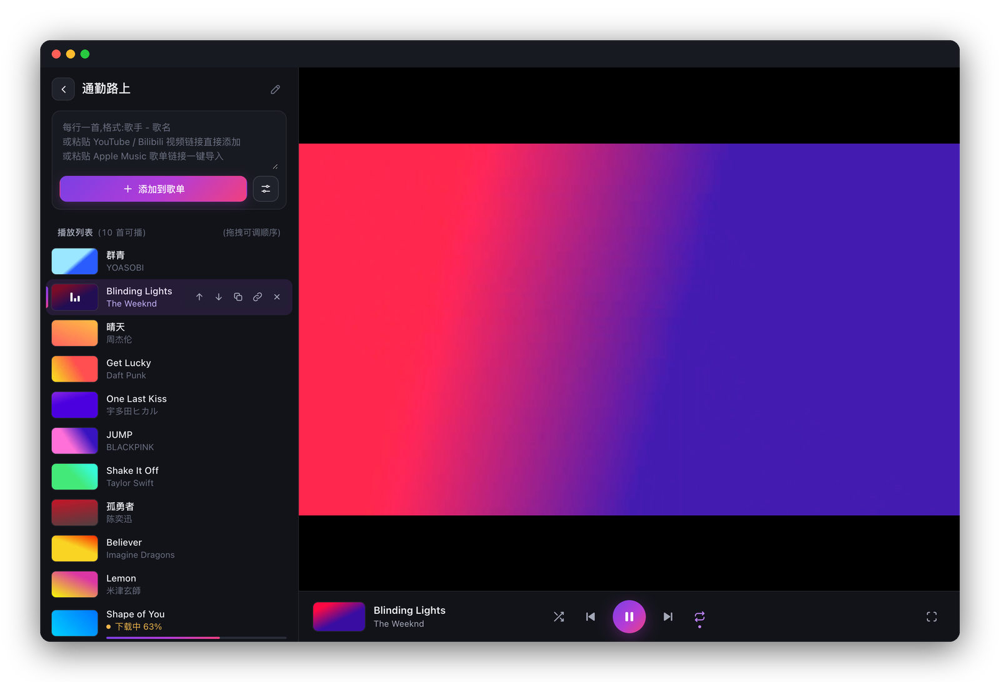
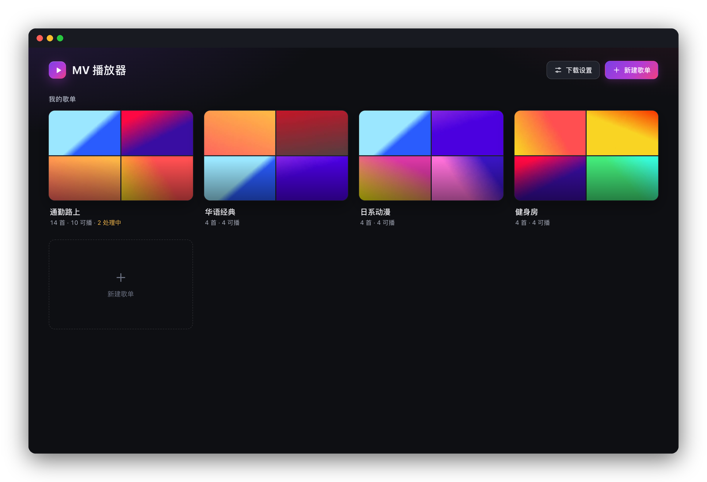
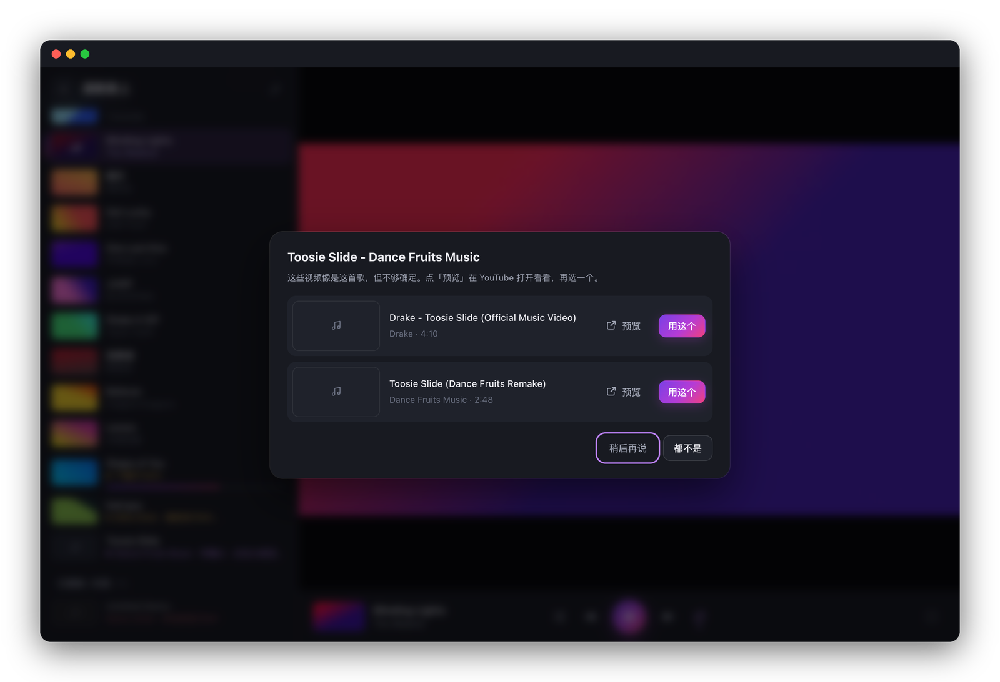

<div align="center">



# MV 播放器

**把歌单变成 MV 播放列表。**
粘贴歌名或 Apple Music 歌单,自动找到并下载每首歌的官方 MV,像听歌一样连续播放。

[](https://github.com/leozhang8654/mv-player/releases/latest)
[](https://github.com/leozhang8654/mv-player/releases)
[](#-下载安装)
[](https://github.com/leozhang8654/mv-player/actions/workflows/release.yml)

[](https://github.com/leozhang8654/mv-player/releases/latest/download/MVPlayer-macOS-AppleSilicon.dmg)
[](https://github.com/leozhang8654/mv-player/releases/latest/download/MVPlayer-macOS-Intel.dmg)
[](https://github.com/leozhang8654/mv-player/releases/latest/download/MVPlayer-Windows-x64-Setup.exe)

</div>

<p align="center">
  
</p>

## ✨ 功能亮点

| | |
|---|---|
| 📋 **一键导入** | 每行一首「歌手 - 歌名」,或直接粘贴 Apple Music 歌单链接、YouTube / Bilibili 视频链接 |
| 🎯 **只要官方 MV** | 多重检测:歌名必须对得上、识别官方频道与推广号、区分 Live / Acoustic / Remix 等版本、对照原曲时长、剔除「一张封面配音频」的静态视频 |
| 🌏 **多语言歌名** | 自动查原文名:「Gunjou」能找到 YOASOBI「群青」,繁简体互通 |
| 🤔 **不确定就问你** | 拿不准的结果进入「待确认」,给出候选让你预览、挑选,不会悄悄下错 |
| 🎬 **专注播放** | 连续播放、随机 / 循环、拖拽排序、音量响度均衡、字幕、全屏 |
| 📚 **多歌单管理** | 同一首歌加入多个歌单只下载一次;移出所有歌单后自动清理文件 |
| 📱 **手机也能看** | 同一 Wi-Fi 下,手机 / iPad 用浏览器打开就能播放 |
| 🔒 **本地优先** | 视频保存在你自己的电脑上,离线可看;不需要注册、不收集任何数据 |

## 📸 截图

<table>
  <tr>
    <td width="50%"></td>
    <td width="50%"></td>
  </tr>
  <tr>
    <td align="center"><b>主页</b> · 歌单封面由 MV 画面拼成</td>
    <td align="center"><b>待确认</b> · 拿不准时由你来选</td>
  </tr>
</table>

<sub>截图使用演示数据(渐变色合成视频),不含真实 MV 画面。</sub>

## 📦 下载安装

前往 [**最新版本**](https://github.com/leozhang8654/mv-player/releases/latest) 下载对应安装包:

| 系统 | 安装包 | 要求 |
|---|---|---|
| macOS · Apple 芯片(M1 及以后) | [`MVPlayer-macOS-AppleSilicon.dmg`](https://github.com/leozhang8654/mv-player/releases/latest/download/MVPlayer-macOS-AppleSilicon.dmg) | macOS 12 及以上 |
| macOS · Intel 芯片 | [`MVPlayer-macOS-Intel.dmg`](https://github.com/leozhang8654/mv-player/releases/latest/download/MVPlayer-macOS-Intel.dmg) | macOS 12 及以上 |
| Windows · 安装版 | [`MVPlayer-Windows-x64-Setup.exe`](https://github.com/leozhang8654/mv-player/releases/latest/download/MVPlayer-Windows-x64-Setup.exe) | Windows 10 / 11(64 位) |
| Windows · 便携版 | [`MVPlayer-Windows-x64.zip`](https://github.com/leozhang8654/mv-player/releases/latest/download/MVPlayer-Windows-x64.zip) | 解压即用,无需安装 |

安装包已附带全部所需组件(yt-dlp、FFmpeg、Deno),无需另外安装;下载组件 yt-dlp 会每天自动更新。

### macOS 安装步骤

1. 打开下载的 DMG,在弹出的安装窗口里把「MV播放器」拖到右边的「应用程序」文件夹。
2. **首次打开前**,打开「终端」(启动台或聚焦搜索「终端」),粘贴下面这行并回车(只需做一次):

   ```bash
   xattr -dr com.apple.quarantine /Applications/MV播放器.app
   ```

   没有任何输出就表示成功。DMG 里的「首次打开必读」也写着这条命令,可以直接复制。
3. 在「应用程序」里双击「MV播放器」即可打开。

> **为什么需要第 2 步?** 本应用未经 Apple 公证。从 macOS 15.1 起,系统设置里的「仍要打开」对这类应用
> 不再起作用(点了没有反应),只能用这条命令解除下载时附加的隔离标记。命令只作用于 MV 播放器本身。
>
> 也可以用一条命令自动完成下载、安装和这一步:
> `curl -fsSL https://raw.githubusercontent.com/leozhang8654/mv-player/main/install-macos.sh | bash`

<details>
<summary><b>macOS:打开后图标一直跳动、窗口打不开?</b></summary>

1.0.0 版的已知问题,1.0.1 起已修复。请下载最新版重新安装,并按上面第 2 步执行命令。
另外不要直接在下载文件夹或 DMG 安装窗口里运行 App,先拖进「应用程序」。

</details>

<details>
<summary><b>Windows:提示「Windows 已保护你的电脑」怎么办?</b></summary>

安装程序未做代码签名,SmartScreen 会提示。点「更多信息 → 仍要运行」即可。
首次启动若 Windows 防火墙询问,允许「专用网络」即可让同一 Wi-Fi 的手机访问。
Windows 版启动后会在浏览器中打开播放器,关闭黑色的命令行窗口即退出。

</details>

## 🚀 快速上手

1. **新建歌单**:主页点「新建歌单」。
2. **粘贴歌曲**:每行一首,例如
   ```
   YOASOBI - 群青
   The Weeknd - Blinding Lights
   周杰伦 - 晴天
   ```
   也可以直接粘贴 Apple Music 歌单链接(需公开分享),一次导入整个歌单。
3. **等待下载**:每首歌自动搜索并下载官方 MV,下载完成即进入播放列表;点击任意一首开始播放。
4. **处理待确认**:显示「待确认」的歌点 ☑,预览候选后选一个,或选「都不是」。
   匹配错了也可以点 🔗 手动指定视频链接。

**快捷键**:空格 播放 / 暂停 · ← / → 上一首 / 下一首 · F 全屏。
macOS 版另有菜单栏:⌘P 播放 / 暂停、⌘← / ⌘→ 切歌、⌘F 视频全屏、⌘+ / ⌘- 缩放。

**数据位置**:曲库与视频保存在 macOS「影片 / MV播放器」、Windows「视频\MV播放器」文件夹。
卸载程序不会删除它们。

## 🔑 YouTube 账号(可选)

不登录也能使用。若下载频繁遇到「请证明你不是机器人」,可在浏览器中登录 YouTube,
然后在播放器的「下载设置」里选择该浏览器:

- **普通免费账号即可**,不需要 YouTube Premium。登录只用于减少人机验证、下载年龄限制的视频。
- 画质上限 1080p,免费账号与会员相同;仅限会员观看的视频无法下载。
- 播放器只在本机读取浏览器的登录状态,不导出、不保存 Cookie;局域网中的其他设备不能修改此设置。
- macOS 首次读取 Chrome 登录状态时会请求钥匙串权限,选择「允许」即可。
- Windows 上建议使用 **Firefox**:新版 Chrome / Edge 对登录信息做了额外加密,下载工具无法读取。

## ❓ 常见问题

<details>
<summary><b>为什么有的歌显示「未找到官方 MV」?</b></summary>

不少歌曲本身没有官方 MV,只有音频、歌词版或现场版。播放器宁可不下,也不会拿翻唱、合集、
静态封面视频来凑数。确定有 MV 的话,可点 ↻ 重试,或点 🔗 手动指定链接。

</details>

<details>
<summary><b>下载失败 / 一直在重试?</b></summary>

多半是 YouTube 的人机验证。打开「下载设置」点「保存并检测连接」查看原因;登录 YouTube 账号通常能解决。
失败的歌会在 15 分钟后起自动重试,也可以点 ↻ 立即重试。

</details>

<details>
<summary><b>手机怎么访问?</b></summary>

手机和电脑连同一个 Wi-Fi,在手机浏览器打开 `http://<电脑的局域网 IP>:8471`。
macOS 版可在菜单「帮助 → 拷贝手机访问地址」一键拷贝;Windows 版启动窗口里会显示该地址。

</details>

<details>
<summary><b>需要一直开着吗?</b></summary>

下载在播放器运行时进行;关闭后,未完成的歌下次启动会继续。已下载的视频随时可看。

</details>

## 🛠 从源码运行

```bash
git clone https://github.com/leozhang8654/mv-player.git && cd mv-player
brew install yt-dlp ffmpeg deno                # 下载工具
python3 -m venv .venv && .venv/bin/pip install -r requirements.txt
.venv/bin/python app.py                        # 打开 http://127.0.0.1:8471
```

项目结构、MV 检测原理、测试与离线评估、打包与发布流程见 [开发与部署说明](docs/DEVELOPMENT.md)。

## ⚠️ 免责声明

本项目是供个人学习与研究使用的本地播放工具,不提供、不托管、不分发任何音视频内容。
所有视频均由用户自行从公开平台获取,版权归原权利人所有。使用时请遵守 YouTube、Bilibili
等平台的服务条款及所在地区的版权法律,勿用于任何商业或侵权用途。

## 🙏 致谢

基于以下优秀的开源项目:[yt-dlp](https://github.com/yt-dlp/yt-dlp) ·
[FFmpeg](https://ffmpeg.org) · [Deno](https://deno.com) · [Flask](https://flask.palletsprojects.com) ·
[OpenCC](https://github.com/yichen0831/opencc-python)。各组件许可证见 [第三方组件说明](THIRD_PARTY_NOTICES.md)。
