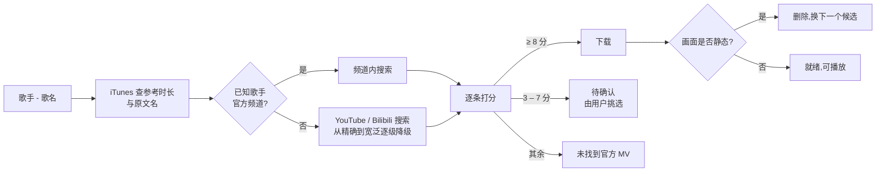

# 开发与部署说明

面向想从源码运行、修改或发布 MV 播放器的开发者。普通用户请直接从
[Releases](https://github.com/leozhang8654/mv-player/releases/latest) 下载安装包。

## 目录

- [从源码运行](#从源码运行)
- [项目结构](#项目结构)
- [MV 检测原理](#mv-检测原理)
- [测试与离线评估](#测试与离线评估)
- [macOS 原生窗口(开发版)](#macos-原生窗口开发版)
- [在 Mac 上常驻运行](#在-mac-上常驻运行)
- [打包与发布](#打包与发布)

## 从源码运行

需要 Python 3.9+,以及下载工具 [yt-dlp](https://github.com/yt-dlp/yt-dlp)、
[FFmpeg](https://ffmpeg.org)(含 ffprobe)和 [Deno](https://deno.com)(yt-dlp 解析 YouTube 需要)。

```bash
brew install yt-dlp ffmpeg deno          # Windows 可用 winget / scoop 安装同名工具
python3 -m venv .venv
.venv/bin/pip install -r requirements.txt
.venv/bin/python app.py                  # 打开 http://127.0.0.1:8471
```

源码运行时,曲库(`library.json`)、视频(`media/`)和下载设置都保存在项目目录。
可用环境变量调整:

| 变量 | 作用 | 默认 |
|---|---|---|
| `MV_DATA_DIR` | 曲库、视频、设置的存放目录 | 项目目录 |
| `MV_PORT` | 服务端口 | `8471` |
| `MV_YTDLP` | yt-dlp 可执行文件路径 | `yt-dlp`(从 PATH 查找) |

yt-dlp 需要经常更新(YouTube 改版很快):`brew upgrade yt-dlp deno`。

## 项目结构

```
app.py              Flask 服务:歌单/曲库 API、后台下载队列、启动时复查曲库
downloader.py       搜索与打分(MV 检测核心)、下载、静态画面检测
catalog.py          iTunes Search API:参考时长、原文歌名与歌手
paths.py            程序目录与数据目录
launcher.py         安装包的启动入口(附带工具、数据目录、yt-dlp 自更新、自检)
static/             前端(原生 HTML/CSS/JS,无构建步骤)
desktop/Sources/    macOS 原生窗口外壳(Swift + WKWebView)
packaging/          macOS / Windows 打包脚本、图标、Windows 安装程序脚本
tools/eval_mv.py    MV 检测离线回归评估
tools/make_screenshots.py   生成 README 截图(演示数据)
tests/              单元测试;tests/fixtures/mv_labels.json 为人工标注的正确/错误视频
```

## MV 检测原理



打分规则(`downloader.py`):

- **歌名硬门槛**:视频标题里必须整词出现歌名(或原文名),否则直接否决,任何加分都救不回来。
  Remaster / Radio Edit / Single Version / From "…" 等后缀匹配时忽略;
  Remix / Version 等特别版找不到时可退而用原版 MV(扣分,「下载设置」里可关闭)。
- **非 MV 内容否决**:标题去掉歌手和歌名后剩下 How I made / Compilation / Meme / Transition /
  AI Video / Teaser / 「X Style」仿作,或「歌名 x 另一首歌」串烧,直接否决。
- **版本扣分**:Acoustic / Live / Remix / Ballroom 等请求里没有的版本词、或 feat. 了请求里没有的歌手,
  扣分,原版存在时一定让位;Visualizer 让位于正式 MV。
- **频道可信度**:歌手本人频道(含 Official / VEVO 写法、合办频道)加分;只是包含歌手名
  (如「某某 Fan France」)罚一半;粉丝 / 歌词频道重罚;与歌手无关的认证频道(推广号)
  只有标题明说是 MV 时才不罚。
- **时长**:与 iTunes 参考时长对照,不到六成的片段/预告、长出 4 分钟以上的电影版扣分;
  与原曲完全等长不加分(往往正是纯音频上传)。
- 标题和频道都看不到歌手的结果(如翻唱请求搜到原唱 MV)最多进「待确认」,不自动下载。
- 下载后每 5 秒取一帧比对,画面基本不动(一张封面配音频)就删除并换下一个候选。
- 已知歌手的官方频道记在 `library.json` 的 `artist_channels`,同歌手的歌以后先在频道内搜。
- 规则升级后,启动时会用新规则复查一次曲库(`AUDIT_VERSION`):错歌删除重找,
  其他版本尝试换成原版(找不到保留),之前没找到的再找一次。

## 测试与离线评估

```bash
python3 -m unittest discover -s tests        # 单元测试(含人工标注集 LabelTests)
python3 tools/eval_mv.py                     # 重放缓存的搜索结果,统计下对/下错/待确认/漏掉
python3 tools/eval_mv.py --online            # 为缺缓存的歌联网补齐(较慢,有节流)
```

- `tests/fixtures/mv_labels.json`:人工标注的正确 / 错误视频。标注正确的必须通过内容检查,
  标注错误的必须被否决或低于下载线。
- 搜索结果缓存在 `search-cache/`(后台下载时自动记录),修改打分规则后先跑 `eval_mv.py`,
  确认「下错」仍为 0 再提高找到率。

## macOS 原生窗口(开发版)

`desktop/Sources/` 是一个 Swift + WKWebView 程序,本身不含业务逻辑,只负责开窗口、起服务、
补菜单栏(⌘V 粘贴、播放控制、缩放、窗口全屏)。开发版指向项目目录运行 `app.py`:

```bash
./desktop/build.sh /Applications     # 不带参数只产出到 desktop/build/
```

App 靠 `Info.plist` 里的 `MVProjectRoot` 找到项目目录,挪动项目后要重新打包。
发布版(见下文)则把后端和工具链一起打进 App,不依赖项目目录。

## 在 Mac 上常驻运行

可以把服务做成 macOS 登录启动项,开机自动运行、崩溃自动重启,关掉窗口也不影响下载。
示例 `~/Library/LaunchAgents/com.leozhang.mv-player.plist`:

```xml
<?xml version="1.0" encoding="UTF-8"?>
<!DOCTYPE plist PUBLIC "-//Apple//DTD PLIST 1.0//EN" "http://www.apple.com/DTDs/PropertyList-1.0.dtd">
<plist version="1.0">
<dict>
    <key>Label</key>             <string>com.leozhang.mv-player</string>
    <key>ProgramArguments</key>
    <array>
        <string>/Users/你/MV播放器/.venv/bin/python</string>
        <string>/Users/你/MV播放器/app.py</string>
    </array>
    <key>WorkingDirectory</key>  <string>/Users/你/MV播放器</string>
    <key>EnvironmentVariables</key>
    <dict><key>PATH</key><string>/opt/homebrew/bin:/usr/local/bin:/usr/bin:/bin</string></dict>
    <key>RunAtLoad</key>         <true/>
    <key>KeepAlive</key>         <true/>
    <key>StandardOutPath</key>   <string>/Users/你/Library/Logs/mv-player.log</string>
    <key>StandardErrorPath</key> <string>/Users/你/Library/Logs/mv-player.log</string>
</dict>
</plist>
```

```bash
launchctl bootstrap gui/$(id -u) ~/Library/LaunchAgents/com.leozhang.mv-player.plist
launchctl kickstart -k gui/$(id -u)/com.leozhang.mv-player     # 重启服务
```

注意:项目不要放在「桌面」「文稿」「下载」里,这些目录受 macOS 隐私保护,后台启动项读不了。
开发版 App 检测到端口已有服务时会直接连上,菜单「重启后台服务」会用 `launchctl kickstart`。

## 打包与发布

| 平台 | 脚本 | 产物 |
|---|---|---|
| macOS(在对应架构的 Mac 上运行) | `packaging/build_macos.sh <版本>` | `dist/MVPlayer-macOS-AppleSilicon.dmg` / `-Intel.dmg` |
| Windows(PowerShell 7) | `packaging\build_windows.ps1 -Version <版本>` | `dist\MVPlayer-Windows-x64-Setup.exe`、`dist\MVPlayer-Windows-x64.zip` |

安装包内容:PyInstaller 打包的后端(`launcher.py` 为入口)+ 附带的 yt-dlp、ffmpeg、ffprobe、deno。
启动时数据放在用户目录(macOS `~/Movies/MV播放器`,Windows `%USERPROFILE%\Videos\MV播放器`),
yt-dlp 复制到数据目录后每天自动更新。脚本最后会运行 `--smoke` 自检。

**发布新版本**:推送 `v` 开头的标签,GitHub Actions(`.github/workflows/release.yml`)会在
Apple 芯片、Intel 与 Windows 构建机上分别打包、自检,并发布到 Releases:

```bash
git tag v1.1.0 && git push origin v1.1.0
```

发布说明放在 `.github/release-notes/v<版本>.md`(可选)。安装包未经 Apple 公证 / Windows 代码签名,
首次打开的提示与处理方法见 README。

更新 README 截图(演示数据,需要本机 Chrome):

```bash
pip install playwright pillow && python3 tools/make_screenshots.py
```
